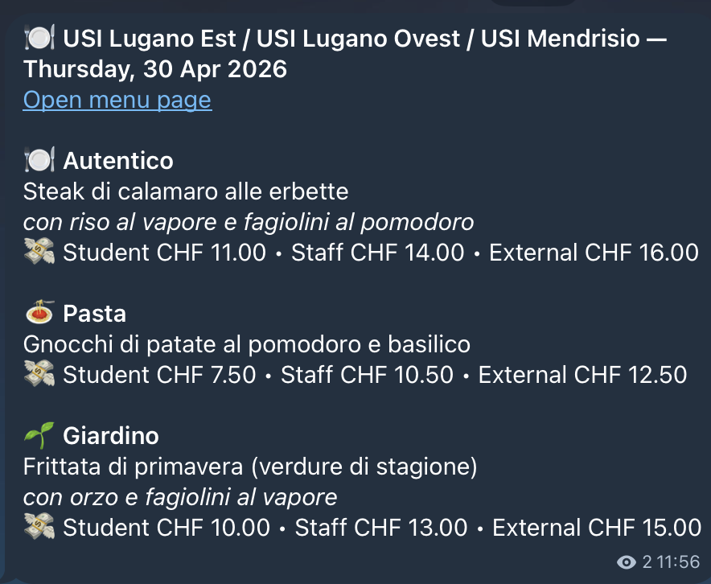
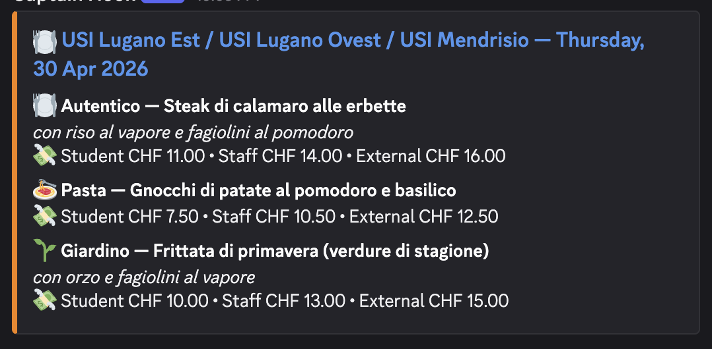

<p align="center">
  
</p>

# USI Mensa Bot

[](https://github.com/kybeka/usi_campus_menu_bot/actions/workflows/send-channel.yml)


[](https://t.me/usi_mensa)


Posts the daily USI mensa menu to [@usi_mensa](https://t.me/usi_mensa) on Telegram and/or to a Discord channel via webhook, around 10:00 Europe/Zurich.

Menus are currently treated as identical across the configured campuses, so the bot sends one combined channel message. On Mondays, it first sends a week-at-a-glance preview for Monday-Friday, marked as tentative because the official menu may still change.

## Disclaimer

This project is unofficial and was created independently. It is not affiliated with, endorsed by, or maintained by the Universita della Svizzera italiana (USI), SV Group, or the USI mensa.

## Features

- Scrapes the official SV Gastronomie menu page with Playwright.
- Posts to Telegram and/or Discord — configure one or both.
- Sends a daily combined menu for all configured campuses.
- Sends a Monday-only weekly preview before the daily message.
- Clicks the real date tabs when collecting weekly menus.
- Uses retry/backoff for transient scrape failures.
- Falls back to the official menu link when scraping breaks.
- Runs from GitHub Actions on a weekday schedule, with a Zurich local-time gate for DST safety.

## Examples

| Telegram | Discord |
|:---:|:---:|
|  |  |

## Example Weekly Preview

Sent on Mondays before the daily message, on both Telegram and Discord (as a code block).

```text
USI Mensa - Week at a glance
Tentative, may change. Check the official menu page for updates.

Day        Menu
---------- ------------------------------------------------------------
Mon 20 Apr Autentico: Cordon bleu di pollo; Pasta: Penne alla norma; Giardino: Piccata di tofu alla crema di datterini
Tue 21 Apr Autentico: Spezzatino di maiale ai funghi; Pasta: Fusilli chiles en nogada; Giardino: Tomino del boscaiolo
Wed 22 Apr Autentico: Polpette di carne al pomodoro; Pasta: Pasta con seppioline; Giardino: Frittata pomodorini e mozzarella
```

## How It Works

- [channel_job.py](channel_job.py) is the scheduled entry point. It checks runtime gates, fetches menu data, builds messages, and sends them to the configured platforms.
- [menu_fetcher.py](menu_fetcher.py) handles Playwright page loading, day-tab clicks, text extraction, parsing, and message formatting (both Telegram HTML and Discord embeds).
- [campus.py](campus.py) stores the campus display names and menu URLs.
- [.github/workflows/send-channel.yml](.github/workflows/send-channel.yml) installs dependencies, installs Chromium, and runs the job.

## Schedule

The workflow runs at `08:00` UTC on weekdays. GitHub Actions often fires scheduled jobs 1–2 hours late, so the Python-side time gate accepts a 4-hour window (10:00–14:00 Europe/Zurich) rather than an exact hour.

Manual `workflow_dispatch` runs bypass that time gate for testing.

## Message Behavior

Daily message:
- Sent Monday-Friday when the current day menu parses successfully.
- Contains all parsed menu cards and prices.
- Uses one combined campus heading.

Monday weekly preview:
- Sent only on Mondays.
- Sent before the normal daily message.
- Sent only if Monday's normal daily menu parsed successfully.
- Reuses Monday's already-fetched menu.
- Scrapes Tuesday-Friday in one shared browser session by clicking each date tab.
- Formats as a monospace table (Telegram) or a code-block embed (Discord).
- Includes a "Tentative, may change" note.

Failure handling:
- No day section found: skip, likely closed/holiday/no menu published.
- Day section found but zero parsed cards: send a fallback status message with the official link.
- Scrape/fetch error after retries: send a fallback status message with the official link.
- Weekly preview batch issue: log the error and continue to the normal daily message.

## Local Run

```bash
python3 -m venv .venv
source .venv/bin/activate
pip install -r requirements.txt
python -m playwright install chromium
```

At least one platform must be configured. Set only the credentials you need — the other platform is silently skipped.

Telegram only:
```bash
TELEGRAM_BOT_TOKEN=... TELEGRAM_CHAT_ID=... TIMEZONE=Europe/Zurich \
python channel_job.py
```

Discord only:
```bash
DISCORD_WEBHOOK_URL=... TIMEZONE=Europe/Zurich \
python channel_job.py
```

Both at once:
```bash
TELEGRAM_BOT_TOKEN=... TELEGRAM_CHAT_ID=... DISCORD_WEBHOOK_URL=... TIMEZONE=Europe/Zurich \
python channel_job.py
```

Add `GITHUB_EVENT_NAME=workflow_dispatch` to bypass the local-time gate during testing.

## Deployment

At least one of Telegram or Discord must be configured. Both can be active at the same time.

### Telegram

Just join [@usi_mensa](https://t.me/usi_mensa) on Telegram — no setup needed.

If you're forking this repo for your own channel:
1. Add `TELEGRAM_BOT_TOKEN` and `TELEGRAM_CHAT_ID` as GitHub Actions secrets.
2. Make sure the Telegram bot is allowed to post in the target channel.
3. See the [Telegram Bot documentation](https://core.telegram.org/bots#how-do-i-create-a-bot) for creating a bot and obtaining its token and your channel's chat ID.

### Discord

1. In your Discord server, go to **Server Settings → Integrations → Webhooks → New Webhook**.
2. Choose the channel, copy the webhook URL.
3. Add it as a `DISCORD_WEBHOOK_URL` GitHub Actions secret.

That's it — no bot account needed. The daily menu posts as a rich embed, and the Monday weekly preview posts as a monospace table in a code block.

### Forking this repo

If you want the bot for your own server or channel, fork the repo and add only the secrets you need. If you only add `DISCORD_WEBHOOK_URL`, Telegram is silently skipped. If you only add the Telegram secrets, Discord is silently skipped.

Keep the workflow enabled and use `workflow_dispatch` for a manual smoke test when needed. The workflow has a `15` minute timeout so a stuck browser install or scrape cannot run indefinitely.

## Updating Campuses

Edit [campus.py](campus.py) to add, remove, or rename campuses. The current channel message assumes menus are identical across campuses and scrapes only `DEFAULT_CAMPUS`.

## Public Repo Notes

- Do not commit `.env`; it is ignored.
- Keep all credentials (`TELEGRAM_BOT_TOKEN`, `TELEGRAM_CHAT_ID`, `DISCORD_WEBHOOK_URL`) in GitHub Actions secrets. The Discord webhook URL is a full secret — anyone with it can post to your channel, so treat it like a password and regenerate it if accidentally exposed.
- The scraper depends on the live SV Gastronomie website. If the site changes its tab markup or text structure, the scrape may need adjustment.

## License

MIT License. See [LICENSE](LICENSE).
